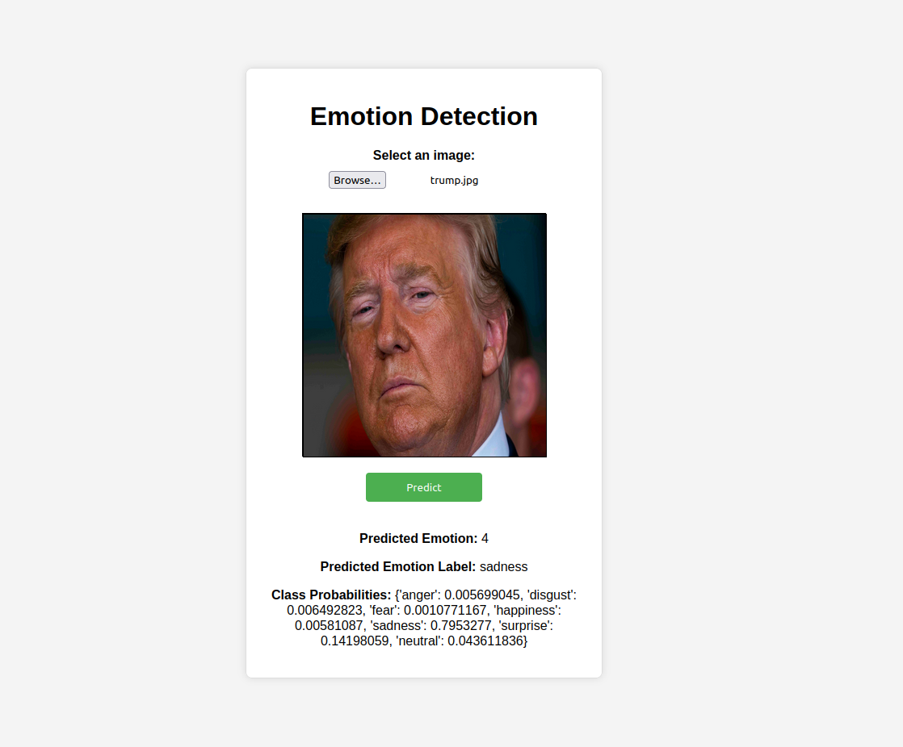

# Emotion Prediction Docker API
1. Select an image from your local computer
2. Click the predict button
3. View the results: The predicted emotion is displayed along with the class probabilities.

# Pull the pre-build image for Docker Hub
### Pull the latest build image
`docker pull deusnexus/emotion_classification:latest`
### Run the container
`docker run --name emotion_prediction_container -p 8000:8000 emotion_prediction_fastapi:latest`
### Open the API on localhost
`http://127.0.0.1:8000`

# Building Image
### Enter docker folder
`cd docker-api`
### Build the image
`docker build -t emotion_prediction_fastapi:latest .`
### Run the container
`docker run --name emotion_prediction_container -p 8000:8000 emotion_prediction_fastapi:latest`
### Open the API Front-end
`http://127.0.0.1:8000`

# Running API directly
### Enter docker-api directory
`cd docker-api`
### Create a local pythong venv
`python3 -m venv venv`
### Activate the virtual environment
`source venv/bin/activate`
### Install the required modules
`pip3 install -r requirements.txt`
### Run the API 
`uvicorn main:app --reload`
### Open the API Front-end
`http://127.0.0.1:8000`